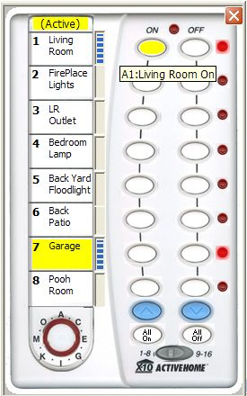



## X10 Firecracker Class for the CM17A

### Description

X10 Firecracker (CM17A) PalmPad Controller

submitted by Tom Pydeski

X10 put out some nifty home control products that communicate

over the power lines and respond to commands to turn on; turn off; dim; etc.

The CM17A is an rf controlled device that receives rf commands from a remote or

the "firecracker" rf pc interface and relays them to the device modules.

The HouseCode can be any 1 of 16 (A through P) and each house code can handle

any of 16 devices (1 to 16).

Keware (http://www.homeseer.com/downloads/index.htm)

had put out an open source usercontrol for the firecracker, but I changed it to make

it a class module, in order to eliminate packaging an ocx with the project.

I took X10's firecracker interface picture of the palmpad and added my own graphic

buttons to simulate the button presses and hovering. I also added the ability to

label the buttons with the device name. Additionally I found some neat code to

rotate an image and implemented that in allowing the selection of a housecode via

the palmpad 's rotary switch. I also added LED's for each device to indicate

their on/off status and used a vertical progress bar to set the dim level.

I implemented a device status for each device. Finally, I was able to figure out

the all on and all off commands (which the firecracker does not support) and

implemented them as well.

Of course all of this is useless if you don't have the x10 hardware that it

interfaces with and controls (http://www.x10.com/automation/ck18a_s_ps32.html)

(They were practically giving away the firecracker starter kit a few years back.)
 
### More Info
 
You MUST have the x10 hardware.

             |
---                |---
**Submitted On**   |2006-03-19 10:47:02
**By**             |[Tom Pydeski](https://github.com/Planet-Source-Code/PSCIndex/blob/master/ByAuthor/tom-pydeski.md)
**Level**          |Intermediate
**User Rating**    |5.0 (15 globes from 3 users)
**Compatibility**  |VB 6\.0
**Category**       |[Complete Applications](https://github.com/Planet-Source-Code/PSCIndex/blob/master/ByCategory/complete-applications__1-27.md)
**World**          |[Visual Basic](https://github.com/Planet-Source-Code/PSCIndex/blob/master/ByWorld/visual-basic.md)
**Archive File**   |[X10\_Firecr1981313192006\.zip](https://github.com/Planet-Source-Code/tom-pydeski-x10-firecracker-class-for-the-cm17a__1-64719/archive/master.zip)

